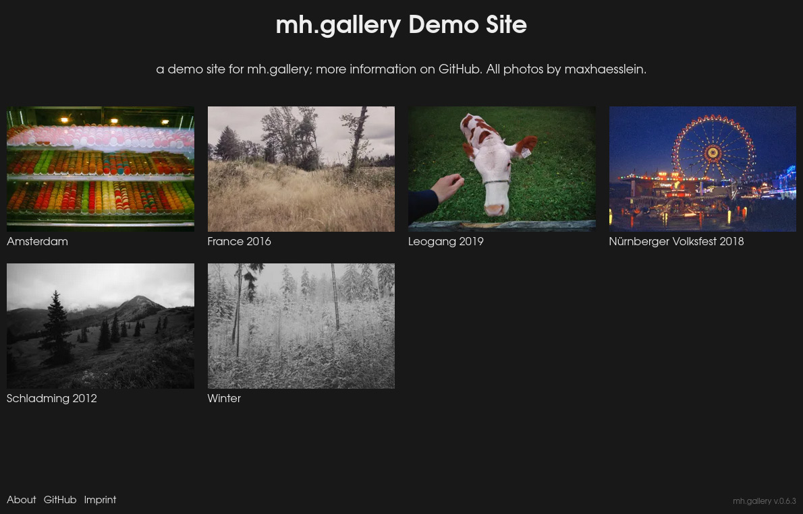
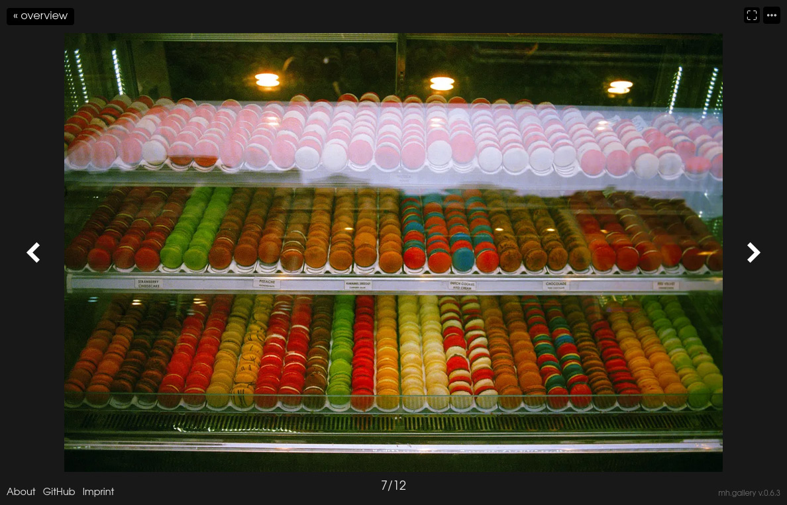

# mh.gallery

A simple and lightweight PHP gallery, without any dependencies. A demo can be found at [gallery.maxhaessle.in](https://gallery.maxhaessle.in).

- this should run on any modern off-the-mill shared hosting environment that supports at least PHP 8.0
- there is no database, the content is just a flat file system on the server
- the folder structure can be independent of the URL structure
- this works without JavaScript (but with it enabled, image navigation gets a bit faster)
- gallery options are stored in .txt files, which makes it easy to port the content to another system
- images are automatically resized to the best resolution for the current viewport size, and are served in modern formats (webp, avif) if possible; resized images are cached on the server, so they don't need to be regenerated every time
- galleries can be hidden or only accessible via a secret link
- lightmode & darkmode

This is an early version, there may still be bugs.

## Screenshots





## Requirements

This should run on any modern off-the-mill shared hosting environment. If something does not work, make sure the hosting environment meets at least these requirements:

- `PHP 8.0` or higher
- write access to the folder where this is installed
- `.htaccess` with `mod_rewrite` support
- `php-mbstring`
- `php-gd`
- `simplexml`, if you want to sort by a `.BridgeSort` file

## Installation

### manually

Download the latest release .zip file, extract it, upload it to a folder on your webserver and open the URL to this folder in a browser. Missing files and folders will be automatically created.

### via git

`cd` into the directory you want to use, then call

```bash
git clone https://github.com/maxhaesslein/mh.gallery.git ./
```

(this will use the `main` branch, which should always contain the latest release)
Then open the URL pointing to this directory in a browser. All the missing files and folders will be automatically created.

## Galleries

In the root directory, there should be a `content/` folder (if it does not exist, open the URL in a browser). In this `content/` folder you can add subfolders for your galleries. You can also organize them in additional subfolders, like  `content/2023/gallery-name/`. In each gallery folder, create a new text file called  `gallery.txt`. This file is needed to detect this folder as a gallery, you can also add some additional information to this file:

```txt
title: my cool gallery
slug: my-cool-gallery
description: this was a very nice and sunny day, and I took some pictures.
hidden: true
thumbnail: image-01.jpg
download_image_enabled: true
download_gallery_enabled: true
image_sort_order: filename
```

If you ommit the title or slug, it gets automatically generated based on the folder name. The slug should only consist of URL safe charactes; use only `a-z`, `0-9` and `-_` to be safe.

Add `.jpg` (or `.jpeg`, `.png`, `.webp`, `avif` or `gif`) files into the gallery folder, the images get detected automatically. (For supported extensions see the `image_extensions` option in `system/config.php`; GIF files will lose their animation)

The `image_sort_order` sets the sort order for images in a gallery and can be set via `custom/config.php` or on a per-gallery-basis via the `gallery.txt` file. The available sort orders are `filename`, `filedate` (file modification date), `exifdate` (date recorded in the exif metadata if available, or file modification date otherwise), `bridge` (sort by a .BridgeSort file, created by Adobe Bridge) or `random` (sort randomly on every visit). This option gets inherited from the parent gallery.

The `download_image_enabled` option activates (or deactivates) the download-link for individual images. The `download_gallery_enabled` option activates (or deactivates) the download-link for all images as a .zip-file. This option can be set via the `custom/config.php` or on a per-gallery-basis in the `gallery.txt` file. Both options get inherited from the parent gallery.

Up to about 1000 images per gallery should work okay without an impact on loading times (depending on your server configuration). The more images, the slower the page loads get, and the more space is needed for cached preview images.

### Sub-Galleries

Galleries can also have sub-galleries. Just create a sub-folder with its own `gallery.txt` file. Sub-Galleries are listed before images. There is always a root gallery, that does not need (but can have) a `gallery.txt` file. If you want to add settings to the root gallery, create a `content/gallery.txt` file.

The `gallery_sort_order` option sets the order for (sub-)galleries and can be set via `custom/config.php` or on a per-gallery-basis for sub-galleries via the `gallery.txt` file. The available sort orders are `title`, `slug`, `foldername` (the name of the folder on the disk) or `order` (a config option `order: ` that can be set via the `gallery.txt` file of the sub-galleries). This option gets inherited from the parent gallery.

If you want to set a thumbnail to use an image from a sub-gallery, us the slug as a path. This could for example look like this:

```txt
thumbnail: sub-gallery/sub-sub-gallery/image-05.jpg
```

### Hidden and Secret Galleries

Setting `hidden: true` will hide this gallery from the index page. You can also completely disable the index page with a config option, see 'Customization' below. The gallery can still be accessed via the URL.

Setting `secret: ` to a string will hide this gallery from the index and also disables the URL of this gallery. The secret string needs to be URL-compatible, so it should only consist of `a-z`, `0-9` and `-_`, for example `secret: abc123`.
To access the gallery, you need to append `?secret={string}` (for example `?secret=abc123`) to the URL of the gallery. This secret will then be saved in the browser session, and as long as the session is active (until you close the browser window), you can access the URL of this gallery.

## Customization

Create a `custom/config.php` file, with your custom options:

```php
<?php
return [
	'site_title' => 'My Very Own Site Title',
	'allow_overview' => true,
	// all config options are listed in 'system/config.php'
];
```

these options will overwrite the default options. You can see a list of all available options in `system/config.php`, including their default values.

### Index

By default, the home page / index will display all galleries that are public.

To hide a gallery from the index, add `hidden: true` to the `gallery.txt` file. To disable the index completely, add `'allow_overview' => false` to the `custom/config.php`.

To add a description to the index page, you can use the root gallery. Add a `content/gallery.txt` with a line `description: my description` inside.

### Snippets

Create a folder called `custom/snippets/`, copy files from `system/site/snippets/` into this folder and edit them. They will be loaded instead of the equivalent file inside the `system/site/snippets/` folder. Create a folder called `custom/templates/`, copy files from `system/site/templates/` into this folder and edit them. They will be loaded instead of their equivalent.

### Custom CSS

Create a folder called `custom/assets/css/` and add `.css` files into this folder. The css files will get loaded automatically, after the system css files. If you want to disable the system css files, you can add `'system_css' => false` to the `custom/config.php`.

### Custom JavaScript

Create a folder called `custom/assets/js/` and add `.js` files into this folder. The js files will get loaded automatically (but `async`, so they may get executed before or after the systems JavaScript). If you want to disable the system js files, you can add `'system_js' => false` to the `custom/config.php`.

### Image Caching

All thumbnails and images will be resized on view. The resized images will be automatically cached inside the `cache/` subfolder. Old cached files will be cleared out automatically after about 30 days. You can disable the cache to save space (at the cost of loading time) via the config option `'cache_disabled' => true` or change the lifetime of cache files (in seconds) via the config option `cache_lifetime`. If possible, the cache should never be disabled.

### Modern image formats (WEBP/AVIF)

WEBP and AVIF support are enabled by default. You can disable them by adding `'webp_enabled' => false` and `'avif_enabled' => false` to the `custom/config.php`.

There is still an additional step, that checks if your server environment supports WEBP or AVIF. For AVIF, you need at least `PHP 8.1`, `GD` compiled with AVIF support and `libavif v.0.8.2` or higher.

## Update

### manually

Make a backup of the `content/` and `custom/` folders, then delete the content of the `cache/` folder as well as the complete `system/` folder and all the files in the root directory (`index.php`, `README.md`, `.htaccess` and `.gitignore`). Then download the latest release .zip file, extract it and upload everything. (But make sure to not overwrite the `content/` and `custom` folders!)

### via git

`cd` into the directory you want to use, then call

```bash
git pull
```

this should update (and checkout) the `main` branch to the latest release. Make sure to read the release notes in `system/changelog.txt`, because you may need to manually delete a file or folder.
